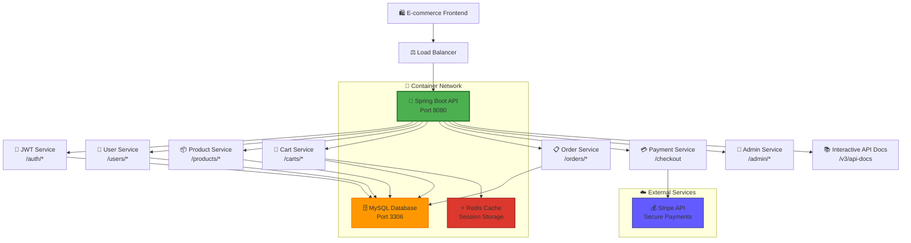
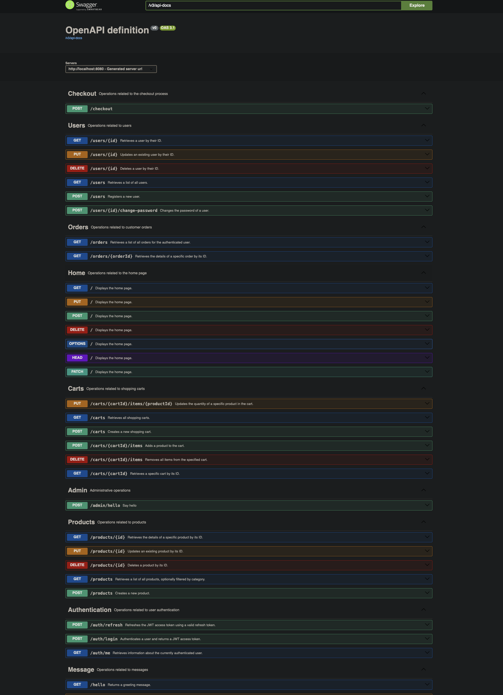
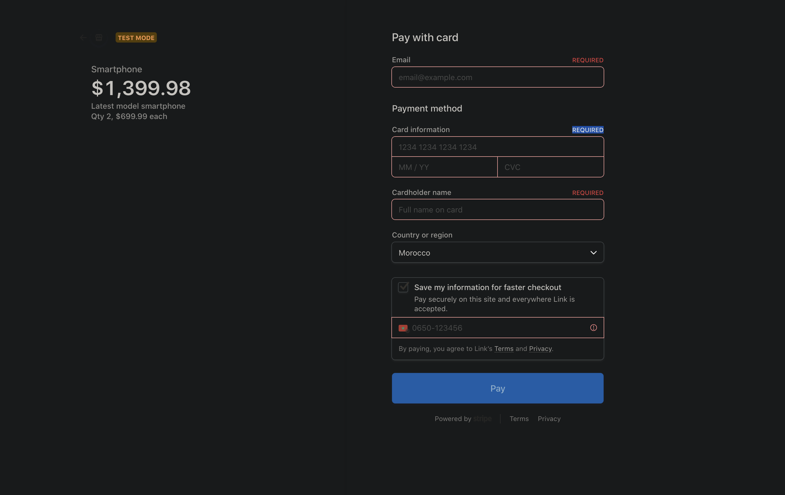

# 🛒 EcommerceAPI – Enterprise E-commerce Backend Platform

<div align="center">


**Production-ready, scalable backend API powering next-generation e-commerce platforms**

[](https://github.com/Serghini04/EcommerceAPI)
[](https://github.com/Serghini04/EcommerceAPI)
[](LICENSE)

</div>

---
## ✨ What Makes This Special?

EcommerceAPI is a **production-ready** backend platform built with enterprise-grade architecture. Unlike basic e-commerce solutions, this API provides advanced features like **UUID-based cart security**, **comprehensive order management**, and **seamless Stripe integration** - all wrapped in a clean, maintainable codebase.

<div align="center">
  
</div>

### 🎯 Built for Real Business Needs
- **UUID-Based Security** with cryptographically secure cart identification
- **Enterprise Authentication** with JWT tokens and refresh mechanisms  
- **Seamless Payments** via Stripe integration with webhook support
- **Real-time Operations** with optimized database queries and caching
- **Production-Ready** Docker containerization and deployment automation

---
## 🎨 System Architecture


---

## 🗄️ Database Schema & Relations

```mermaid
erDiagram
    USERS ||--|| PROFILES : "has"
    USERS ||--o{ ADDRESSES : "owns"
    USERS ||--o{ WISHLIST : "maintains"
    USERS ||--o{ ORDERS : "places"
    USERS ||--o{ PAYMENT_METHODS : "stores"
    
    PRODUCTS ||--o{ WISHLIST : "appears_in"
    PRODUCTS ||--o{ PRODUCT_IMAGES : "has"
    PRODUCTS ||--o{ INVENTORY : "tracks"
    PRODUCTS }o--|| CATEGORIES : "belongs_to"
    PRODUCTS ||--o{ CART_ITEMS : "contained_in"
    PRODUCTS ||--o{ ORDER_ITEMS : "ordered_as"
    PRODUCTS ||--o{ REVIEWS : "receives"
    
    CARTS ||--o{ CART_ITEMS : "contains"
    ORDERS ||--o{ ORDER_ITEMS : "includes"
    ORDERS ||--|| SHIPPING_DETAILS : "has"
    ORDERS ||--o{ PAYMENT_TRANSACTIONS : "processes"
    
    CATEGORIES ||--o{ SUBCATEGORIES : "contains"
    
    USERS {
        bigint id PK "Auto-increment ID"
        varchar name "Full name"
        varchar email UK "Unique email"
        varchar password "BCrypt hashed"
        enum role "USER, ADMIN, MANAGER"
        boolean email_verified "Email confirmation"
        datetime created_at "Registration timestamp"
        datetime updated_at "Last modification"
        datetime last_login "Login tracking"
    }
    
    PROFILES {
        bigint id PK,FK "Links to USERS"
        longtext bio "User biography"
        varchar phone_number "Contact number"
        date date_of_birth "Birthday"
        int loyalty_points "Reward points"
        varchar profile_image_url "Avatar URL"
        json preferences "User settings JSON"
    }
    
    PRODUCTS {
        bigint id PK "Product identifier"
        varchar name "Product title"
        varchar sku UK "Stock keeping unit"
        decimal price "Current price"
        decimal original_price "MSRP"
        longtext description "Rich description"
        json specifications "Technical specs"
        tinyint category_id FK "Category reference"
        boolean is_active "Visibility flag"
        int view_count "Analytics counter"
        decimal average_rating "Computed rating"
        int review_count "Review counter"
        datetime created_at
        datetime updated_at
    }
    
    CATEGORIES {
        tinyint id PK "Category ID"
        varchar name "Category name"
        varchar slug UK "URL-friendly name"
        varchar description "Category description"
        varchar image_url "Category banner"
        tinyint parent_id FK "Nested categories"
        int sort_order "Display order"
        boolean is_active "Visibility"
    }
    
    INVENTORY {
        bigint id PK
        bigint product_id FK
        int stock_quantity "Available stock"
        int reserved_quantity "Cart reservations"
        int reorder_level "Low stock threshold"
        varchar warehouse_location "Storage info"
        datetime last_restocked
    }
    
    CARTS {
        binary id PK "UUID for security"
        bigint user_id FK "Optional user link"
        varchar session_id "Guest sessions"
        decimal subtotal "Calculated total"
        json metadata "Cart settings"
        datetime created_at
        datetime expires_at "TTL for cleanup"
    }
    
    CART_ITEMS {
        bigint id PK
        binary cart_id FK
        bigint product_id FK
        int quantity "Item count"
        decimal unit_price "Price snapshot"
        json product_snapshot "Product data backup"
        datetime added_at
    }
    
    ADDRESSES {
        bigint id PK
        bigint user_id FK
        enum type "BILLING, SHIPPING, BOTH"
        varchar street "Street address"
        varchar city "City name"
        varchar state "State/Province"
        varchar postal_code "ZIP/Postal code"
        varchar country "Country code"
        boolean is_default "Primary address"
        json coordinates "Lat/Lng for delivery"
    }
    
    ORDERS {
        bigint id PK
        varchar order_number UK "Human-readable ID"
        bigint user_id FK
        enum status "PENDING, CONFIRMED, SHIPPED, DELIVERED, CANCELLED"
        decimal subtotal "Items total"
        decimal tax_amount "Calculated tax"
        decimal shipping_cost "Delivery fee"
        decimal discount_amount "Applied discounts"
        decimal total_amount "Final total"
        varchar payment_status "PENDING, PAID, FAILED, REFUNDED"
        varchar currency_code "ISO currency"
        json billing_address "Snapshot"
        json shipping_address "Snapshot"
        text order_notes "Customer notes"
        datetime created_at
        datetime shipped_at
        datetime delivered_at
    }
    
    ORDER_ITEMS {
        bigint id PK
        bigint order_id FK
        bigint product_id FK
        varchar product_name "Name snapshot"
        varchar product_sku "SKU snapshot"
        int quantity "Ordered quantity"
        decimal unit_price "Price at order time"
        decimal total_price "Line total"
        json product_snapshot "Full product backup"
    }
    
    PAYMENT_TRANSACTIONS {
        bigint id PK
        bigint order_id FK
        varchar stripe_payment_intent_id UK "Stripe reference"
        varchar transaction_type "PAYMENT, REFUND, PARTIAL_REFUND"
        decimal amount "Transaction amount"
        varchar currency "Transaction currency"
        varchar status "SUCCESS, FAILED, PENDING"
        json stripe_metadata "Full Stripe response"
        datetime processed_at
    }
    
    REVIEWS {
        bigint id PK
        bigint product_id FK
        bigint user_id FK
        int rating "1-5 stars"
        text review_text "Review content"
        json images "Review photos"
        boolean is_verified_purchase "Purchase confirmation"
        int helpful_votes "Community votes"
        datetime created_at
    }
    
    WISHLIST {
        bigint product_id PK,FK
        bigint user_id PK,FK
        datetime added_at "Wishlist timestamp"
        text notes "User notes"
    }
```



---

## 🚀 Core Features & Capabilities

### 💼 Business Logic Excellence
- **UUID-based Carts**: Secure cart identification for guest and logged-in users
- **Role-Based Access Control**: USER/ADMIN permissions system
- **Order Management**: Complete order lifecycle tracking
- **Category-based Products**: Organized product catalog
- **User Profiles**: Extended user information with addresses and wishlist

### 🔒 Security Features
- **OAuth 2.0 + JWT**: Industry-standard authentication with refresh tokens
- **Role-Based Access Control**: Granular permissions (USER, ADMIN, MANAGER)
- **Password Security**: BCrypt hashing with configurable rounds
- **UUID-based Carts**: Cryptographically secure cart identification
- **Rate Limiting**: API abuse prevention (configurable per endpoint)
- **Input Validation**: Comprehensive request sanitization and validation
- **CORS Configuration**: Secure cross-origin resource sharing

### ⚡ Performance Optimizations
- **Connection Pooling**: HikariCP for optimal database performance
- **JPA Optimization**: Lazy loading to reduce N+1 queries
- **Database Indexing**: Strategic indexes for common query patterns
- **Efficient Pagination**: Large dataset handling
- **UUID Security**: Cryptographically secure cart identification

### 🛠️ Developer Experience
- **OpenAPI 3.0**: Auto-generated interactive documentation
- **Global Exception Handling**: Consistent error responses across all endpoints
- **Request/Response DTOs**: Clean API contracts with validation
- **Structured Logging**: JSON-formatted logs with correlation IDs
- **Health Checks**: Comprehensive application monitoring endpoints
- **Hot Reload**: Development-friendly configuration

---

## 🏁 Quick Start

### Prerequisites

- **Java 17+**
- **Docker & Docker Compose**
- **Maven 3.8+**
- **Your favorite IDE**

### Launch in Seconds

```bash

cd EcommerceAPI
mv .env.example .env   # Fill in your secrets
make up                # Start everything
```

- **API Playground**: [http://localhost:8080/swagger-ui.html](http://localhost:8080/swagger-ui.html)
<div align="center">
  
</div>

- **Health Check**: [http://localhost:8080/actuator/health](http://localhost:8080/actuator/health)
- **Database**: `localhost:3306` (see `.env` for credentials)

---

## 📚 API Reference

### 🔐 Authentication & Authorization
```http
POST /auth/login                   # User authentication & JWT token
POST /auth/refresh                 # Refresh JWT access token
GET  /auth/me                      # Get current user profile
```
<div align="center">
  
</div>

### 👥 User Management
```http
GET    /users                     # Retrieve all users [ADMIN]
POST   /users                     # Register new user
GET    /users/{id}                # Get user by ID
PUT    /users/{id}                # Update user profile
DELETE /users/{id}                # Delete user account [ADMIN]
POST   /users/{id}/change-password # Change user password
```

<div align="center">
  
</div>

### 🛍️ Product Catalog Management
```http
GET    /products                  # Browse products (filter by category)
GET    /products/{id}             # Product details & specs
POST   /products                  # Add new products [ADMIN]
PUT    /products/{id}             # Update product info [ADMIN]
DELETE /products/{id}             # Remove products [ADMIN]
```
<div align="center">
  
</div>

### 🛒 Advanced Cart System
```http
GET    /carts                     # View all carts [ADMIN]
POST   /carts                     # Create new shopping cart
GET    /carts/{cartId}            # Get specific cart contents
POST   /carts/{cartId}/items      # Add product to cart
PUT    /carts/{cartId}/items/{productId} # Update item quantity
DELETE /carts/{cartId}/items      # Clear entire cart
```

<div align="center">
  
</div>

<div align="center">
  
</div>


### 💳 Seamless Checkout & Payments
```http
POST   /checkout                  # Create Stripe payment session
```

<div align="center">
  
</div>


### 📋 Order Management
```http
GET    /orders                    # User order history
GET    /orders/{orderId}          # Specific order details
```

### 🔧 Admin Operations
```http
POST   /admin/hello               # Admin dashboard access
```


---

## 🛠️ Configuration & Deployment

### 🌍 Environment Variables

```env
# Database Configuration
#  openssl rand -base64 64
JWT_SECRET=2ez10YiQ/I+zS8ULAv0MIbkW5Hg7a2FaQ2xIINehIvlnpoS1iLei1FId2uiSmVVxRdc1a6Y+lg1reMFGpbD+tg==
websiteUrl=http://localhost:4242
DB_PASSWORD=MyPassword!
STRIPE_API_KEY=sk_txxxxxxxx
STRIPE_SECRET_KEY=sk_test_xxx
STRIPE_WEBHOOK_SECRET=whsec_xxx
```

### 🐳 Docker Deployment

```yaml
version: '3.8'
services:
  db:
    image: mysql:8.0
    environment:
      MYSQL_ROOT_PASSWORD: ${DB_PASSWORD}
      MYSQL_DATABASE: ${DB_NAME}
    ports:
      - "${DB_PORT}:3306"
    volumes:
      - mysql_data:/var/lib/mysql
    healthcheck:
      test: ["CMD", "mysqladmin", "ping", "-h", "localhost"]
      interval: 30s
      timeout: 10s
      retries: 5

  api:
    build: .
    depends_on:
      db:
        condition: service_healthy
    environment:
      SPRING_DATASOURCE_URL: jdbc:mysql://db:3306/${DB_NAME}
      SPRING_DATASOURCE_USERNAME: root
      SPRING_DATASOURCE_PASSWORD: ${DB_PASSWORD}
    ports:
      - "${SERVER_PORT}:8080"

volumes:
  mysql_data:
```

---

## 🏗️ Project Structure

```
EcommerceAPI/
├── 📁 src/main/java/com/serghini/store/
│   ├── 📁 config/          # Application configuration
│   ├── 📁 controllers/     # REST API endpoints
│   ├── 📁 dtos/           # Data Transfer Objects
│   ├── 📁 entities/       # JPA entities
│   ├── 📁 repositories/   # Data access layer
│   ├── 📁 services/       # Business logic layer
│   ├── 📁 exceptions/     # Custom exception handling
│   └── 📁 mappers/        # Entity ↔ DTO mappers
├── 📁 src/main/resources/
│   ├── 📄 application.yml # Spring configuration
│   └── 📁 db/migration/   # Database migrations
├── 📄 Dockerfile         # Container configuration
├── 📄 docker-compose.yml # Multi-container setup
├── 📄 pom.xml            # Maven dependencies
└── 📄 README.md          # This file
```

---

## 🔐 Security & Compliance

### Multi-Layer Security Architecture
- **🔒 Transport Layer**: TLS 1.3 encryption for all communications
- **🛡️ Application Layer**: JWT tokens with refresh rotation and blacklisting
- **🔐 Database Layer**: Encrypted connections with parameterized queries
- **⚡ Cache Layer**: Redis AUTH with password protection
- **🚨 Monitoring Layer**: Real-time threat detection and alerting

### Security Best Practices
- **Input Validation**: Comprehensive request sanitization and validation
- **SQL Injection Protection**: Parameterized queries and ORM best practices  
- **XSS Prevention**: Output encoding and Content Security Policy headers
- **CSRF Protection**: Token-based CSRF prevention for state-changing operations
- **Rate Limiting**: Configurable request throttling per endpoint and user
- **Audit Logging**: Comprehensive security event logging and monitoring

### Compliance Features
- **GDPR Ready**: Data portability, right to be forgotten, consent management
- **PCI DSS**: Payment data security with Stripe tokenization
- **SOC 2**: Security controls for availability, processing integrity, and confidentiality

---

## 📈 Advanced Features

### Real-time Capabilities
- **Live Cart Sync**: Real-time cart updates across multiple devices
- **Inventory Updates**: Instant stock level changes with WebSocket notifications
- **Order Tracking**: Live order status updates with push notifications
- **Admin Dashboard**: Real-time sales metrics and system monitoring

### AI-Powered Features
- **Smart Recommendations**: Machine learning-based product suggestions
- **Dynamic Pricing**: AI-driven price optimization based on demand
- **Fraud Detection**: Advanced pattern recognition for suspicious activities
- **Inventory Prediction**: ML-based stock level forecasting

### Integration Ecosystem
- **Payment Gateways**: Stripe, PayPal, Square integration ready
- **Shipping Partners**: FedEx, UPS, DHL API integration
- **Email Services**: SendGrid, Mailgun, Amazon SES support
- **Analytics**: Google Analytics, Mixpanel integration
- **CDN**: Cloudflare, AWS CloudFront support

---

## 📚 Documentation & Resources

### API Documentation
- **🎮 Interactive API**: Swagger UI with live testing capabilities
- **📖 Detailed Guides**: Comprehensive endpoint documentation
- **🔧 Integration Examples**: Sample code in multiple languages
- **🎯 Best Practices**: Recommended usage patterns and optimizations

### Developer Resources
- [🚀 Getting Started Guide](docs/getting-started.md)
- [🏗️ Architecture Deep Dive](docs/architecture.md)
- [🔒 Security Implementation](docs/security.md)
- [📊 Performance Tuning](docs/performance.md)
- [🐳 Docker Deployment](docs/docker.md)
- [☸️ Kubernetes Guide](docs/kubernetes.md)

---

<div align="center">

**⚡ Built with passion and precision by [Mehdi Serghini](https://github.com/Serghini04)**

*Engineered for enterprise-grade e-commerce excellence and scalable business growth*

**⭐ Star this repository if you found it revolutionary!**
